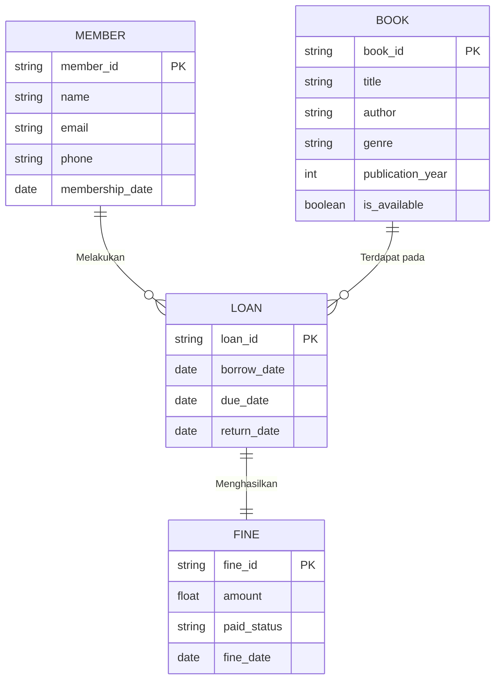

# Library Borrowing Tracker System

## Project Overview
A comprehensive database-driven web application for managing library book borrowing operations. This system allows librarians to track books, manage members, and monitor borrowing activities with an intuitive interface.

**Project Duration:** 5 Weeks  
**Team Size:** 2-3 Students  
**Database:** MySQL  
**Frontend:** Web-based Interface

---

## Team Members
- Daffa M. Siddiq - 24/533358/PA/22569
- Mahardika Ramadhana - 24/538247/PA/22831
- Hammam Muhammad Yazid - 24/534894/PA/22687

---

## System Objectives
- Manage book inventory and availability
- Track member registrations and profiles
- Handle book borrowing and return operations
- Generate reports on library usage
- Provide search functionality for books and members

---

## Database Design

### Entity-Relationship Diagram (ERD)


### Relational Schema
**Normalized to 3NF**

#### Tables Structure:
```sql
BOOK (book_id, title, author, publication_year, genre, is_available)
MEMBER (member_id, name, email, phone, membership_date)  
LOAN (loan_id, book_id, member_id, borrow_date, due_date, return_date)
```

#### Key Constraints:
- **Primary Keys:** book_id, member_id, loan_id
- **Foreign Keys:** 
  - LOAN.book_id → BOOK.book_id
  - LOAN.member_id → MEMBER.member_id

---

## Technologies Used

### Backend
- **Database:** MySQL 8.0+
- **Server:** Node.js with Express.js
- **ORM:** Sequelize ORM

### Frontend  
- **Framework:** React.js
- **Styling:** CSS3 with Bootstrap
- **HTTP Client:** Axios

### Tools & Utilities
- **Version Control:** Git & GitHub
- **ERD Design:** ERDPlus
- **API Testing:** Postman
- **Project Management:** GitHub Projects

---

## Installation & Setup

### Prerequisites
- Node.js (v16 or higher)
- MySQL Server (v8.0 or higher)
- Git

### Step-by-Step Setup

1. **Clone Repository**
   ```bash
   git clone https://github.com/your-username/DBProject_GroupX_LibrarySystem.git
   cd DBProject_GroupX_LibrarySystem
   ```

2. **Database Configuration**
   ```bash
   # Create database
   mysql -u root -p
   CREATE DATABASE library_system;
   exit;
   
   # Import schema
   mysql -u root -p library_system < database/schema.sql
   ```

3. **Backend Setup**
   ```bash
   cd backend
   npm install
   
   # Configure environment variables
   cp .env.example .env
   # Edit .env with your database credentials
   
   npm start
   ```

4. **Frontend Setup**
   ```bash
   cd frontend
   npm install
   npm start
   ```

5. **Access Application**
   - Frontend: http://localhost:3000
   - Backend API: http://localhost:5000

---

## Features Implemented

### Core CRUD Operations
- **Books Management:** Add, view, update, delete books
- **Members Management:** Register, update, deactivate members  
- **Loans Management:** Borrow, return, track overdue books

### Search & Reporting
- **Book Search:** By title, author, genre
- **Member Search:** By name, ID
- **Reports:** Active loans, overdue books, popular books

### User Interface
- Responsive design for desktop and mobile
- Intuitive forms for all operations
- Real-time status updates

---

## Project Timeline

### Week 1: Project Proposal & ERD
- Problem analysis and requirements gathering
- ERD design using ERDPlus
- Project repository setup

### Week 2: Database Implementation  
- Relational schema design
- SQL implementation with constraints
- Sample data population

### Week 3: CRUD Operations
- Backend API development
- Basic CRUD endpoints testing
- Frontend-backend integration

### Week 4: Application Integration
- Complete web interface
- Search and reporting features
- System testing and bug fixes

### Week 5: Final Polish & Documentation
- Performance optimization
- Comprehensive documentation
- Final presentation preparation

---

## Repository Structure
```
DBProject_GroupX_LibrarySystem/
├── week1_proposal_ERD/
│   ├── project_proposal.pdf
│   └── library_erd.png
├── week2_schema_SQL/
│   ├── schema.sql
│   └── sample_data.sql
├── week3_CRUD_demo/
│   ├── crud_operations.sql
│   └── api_endpoints.md
├── week4_integration/
│   ├── frontend/
│   ├── backend/
│   └── screenshots/
├── week5_final_report/
│   ├── final_report.pdf
│   └── presentation.pptx
├── documentation/
│   ├── API_Documentation.md
│   └── User_Manual.md
└── README.md
```

---

## Sample Queries

### 1. Find Available Books by Author
```sql
SELECT book_id, title, genre 
FROM BOOK 
WHERE author LIKE '%Rowling%' AND is_available = TRUE;
```

### 2. Get Member Borrowing History
```sql
SELECT m.name, b.title, l.borrow_date, l.return_date
FROM MEMBER m
JOIN LOAN l ON m.member_id = l.member_id
JOIN BOOK b ON l.book_id = b.book_id
WHERE m.member_id = 'STU001'
ORDER BY l.borrow_date DESC;
```

### 3. Overdue Books Report
```sql
SELECT m.name, b.title, l.due_date
FROM LOAN l
JOIN MEMBER m ON l.member_id = m.member_id
JOIN BOOK b ON l.book_id = b.book_id
WHERE l.return_date IS NULL AND l.due_date < CURDATE();
```

---

## Troubleshooting

### Common Issues & Solutions

**Database Connection Error**
- Verify MySQL service is running
- Check database credentials in .env file
- Ensure database 'library_system' exists

**Frontend Not Loading**
- Confirm backend server is running on port 5000
- Check CORS configuration
- Verify all dependencies are installed

**API Endpoints Returning Errors**
- Check database table structures match schema
- Verify foreign key constraints
- Review server logs for detailed error messages

---

## License
This project is licensed under the MIT License.

*Last Updated: Fri 14 Nov 18:44 GMT+7*  
*Project Status: Active Development*
